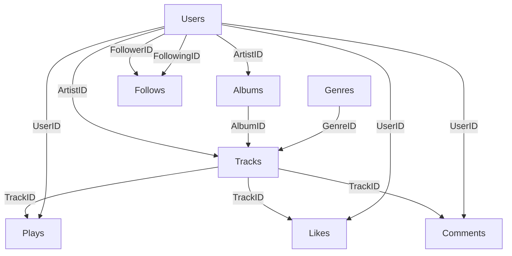

# SoundCloud Clone - MSSQL Veritabanı Mimarisi

## 📊 Veritabanı Yapısı

Bu proje, **SoundCloud** benzeri bir müzik paylaşım platformu için gelişmiş bir MSSQL veritabanı mimarisini içerir.

### 🎯 Özellikler

- ✅ **Schema-based Architecture**: Mantıksal ayrım için 3 şema
- ✅ **Gelişmiş İlişkiler**: Foreign Key + Cascade kuralları
- ✅ **Performance**: İndeksler ve optimizasyonlar
- ✅ **SoundCloud Özellikleri**: Waveform, zaman damgalı yorumlar
- ✅ **Analytics**: Play count, trending tracks

---

## 📁 Dosya Yapısı

```
soundcloud-clone/
└── database/
    ├── 01_CreateDatabase.sql       # Veritabanı oluşturma
    ├── 02_CreateSchemas.sql        # 3 şema tanımlama
    ├── 03_CreateTables_Identity.sql # Kullanıcı tablosu
    ├── 04_CreateTables_Music.sql    # Müzik tabloları
    ├── 05_CreateTables_Interaction.sql # Etkileşim tabloları
    ├── 06_SampleData_Insert.sql    # Test verileri
    ├── 07_Useful_Queries.sql       # Hazır sorgular
    └── README.md                   # Bu dosya
```

---

## 🗂️ Şema Yapısı

### 1️⃣ **Identity Schema**
Kullanıcı yönetimi ve kimlik doğrulama

| Tablo | Açıklama |
|-------|----------|
| `Users` | Kullanıcılar (sanatçı/dinleyici), profil bilgileri, verified badge |

### 2️⃣ **Music Schema**
Müzik içerikleri ve metadata

| Tablo | Açıklama |
|-------|----------|
| `Genres` | Müzik türleri (Trap, Lo-Fi, House...) |
| `Albums` | Albüm/EP koleksiyonları |
| `Tracks` | Şarkılar, waveform data, audio URL |

### 3️⃣ **Interaction Schema**
Kullanıcı etkileşimleri

| Tablo | Açıklama |
|-------|----------|
| `Plays` | Dinleme kayıtları (analytics için) |
| `Likes` | Beğeniler (kalp ikonu) |
| `Comments` | Zaman damgalı yorumlar (SoundCloud özelliği) |
| `Follows` | Takip sistemi |

---

## 🚀 Kurulum

### Adım 1: Veritabanını Oluştur
```sql
-- SQL Server Management Studio (SSMS) veya Azure Data Studio'da çalıştır
sqlcmd -S localhost -i 01_CreateDatabase.sql
```

### Adım 2: Şemaları Oluştur
```sql
sqlcmd -S localhost -i 02_CreateSchemas.sql
```

### Adım 3: Tabloları Oluştur (Sırayla)
```sql
sqlcmd -S localhost -i 03_CreateTables_Identity.sql
sqlcmd -S localhost -i 04_CreateTables_Music.sql
sqlcmd -S localhost -i 05_CreateTables_Interaction.sql
```

### Adım 4: Test Verileri Ekle
```sql
sqlcmd -S localhost -i 06_SampleData_Insert.sql
```

---

## 🔍 Örnek Sorgular

### En Popüler Şarkılar
```sql
SELECT TOP 10
    T.Title,
    U.Username AS Artist,
    COUNT(P.PlayID) AS TotalPlays
FROM [Music].[Tracks] T
INNER JOIN [Identity].[Users] U ON T.ArtistID = U.UserID
LEFT JOIN [Interaction].[Plays] P ON T.TrackID = P.TrackID
WHERE T.IsPublic = 1
GROUP BY T.Title, U.Username
ORDER BY TotalPlays DESC;
```

### Zaman Damgalı Yorumlar (SoundCloud Özelliği)
```sql
SELECT 
    C.Content,
    C.TimestampSeconds,
    U.Username
FROM [Interaction].[Comments] C
INNER JOIN [Identity].[Users] U ON C.UserID = U.UserID
WHERE C.TrackID = 1
ORDER BY C.TimestampSeconds ASC;
```

Daha fazla örnek için: `07_Useful_Queries.sql`

---

## 🎨 Önemli Özellikler

### 1. Waveform Desteği
```sql
-- Tracks tablosunda JSON formatında saklanır
WaveformData NVARCHAR(MAX)
-- Örnek: [0.2, 0.5, 0.8, 0.6, 0.9, ...]
```

### 2. Verified Badge (Mavi Tik)
```sql
Users.IsVerified BIT
```

### 3. Misafir Dinleme
```sql
-- Plays tablosunda UserID NULL olabilir
Plays.UserID INT NULL
```

### 4. Zaman Damgalı Yorumlar
```sql
Comments.TimestampSeconds INT
-- Şarkının kaçıncı saniyesine yorum yapıldığını tutar
```

---

## 🔐 Foreign Key İlişkileri



---

## 📈 Performans İyileştirmeleri

### İndeksler
- ✅ Username/Email için UNIQUE INDEX
- ✅ Slug için UNIQUE INDEX (SEO dostu URL)
- ✅ Foreign Key'ler için NONCLUSTERED INDEX
- ✅ Composite Index: `(IsPublic, PlayCount DESC)`

### Veri Bütünlüğü
- ✅ CHECK Constraint: Email formatı
- ✅ CHECK Constraint: Kendini takip edememe
- ✅ UNIQUE Constraint: Aynı şarkıyı 2 kez beğenememe

---

## 🛠️ Teknolojiler

- **MSSQL Server 2019+**
- **T-SQL**
- **Schema-based Design**
- **Normalization (3NF)**

---

## 📝 Notlar

1. **CASCADE Kuralları**:
   - Sanatçı silindiğinde albümleri SİLİNİR (`CASCADE`)
   - Albüm silindiğinde şarkılar KALIR (`SET NULL`)
   - Kullanıcı silindiğinde dinleme kayıtları KALIR (`SET NULL`)

2. **DATETIME2** kullanımı:
   - Yüksek hassasiyet için `DATETIME2(7)` tercih edildi
   - Milisaniye düzeyinde zaman kaydı

3. **BIGINT** kullanımı:
   - `Plays` tablosunda milyonlarca kayıt olabilir

---

## 👨‍💻 Geliştirici Notları

### Sonraki Adımlar (Node.js Entegrasyonu):
1. **mssql** paketi ile bağlantı
2. Stored Procedure'ler yazılmalı (güvenlik için)
3. Connection pooling yapılandırması
4. ORM olarak **Sequelize** veya **Prisma** kullanılabilir

### Eklenebilecek Özellikler:
- [ ] Playlist sistemi
- [ ] Repost/Share özelliği
- [ ] Download count takibi
- [ ] Collaboration (feat) tablosu
- [ ] Report/Flag sistemi

---

## 📧 İletişim

Sorularınız için: **Akademik Ödev Projesi**

---

**📌 Bu veritabanı mimarisi SoundCloud'un temel özelliklerini kapsamaktadır ve production-ready seviyesindedir!**
